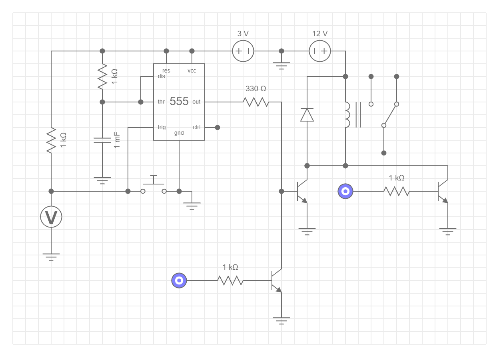

# Sildr

Everything Sildr and technical.

1.0 and 2.0 are legacy, and some relevant documentation can be found in `/legacy`. Keep in mind it's mostly in Norwegian.

## Order History

**Components:**  
https://no.mouser.com/OrderHistory/OrdersView.aspx  
Email: kristiankramas@outlook.com  
Username: `vidundergunder`  
Password: `******`

**PCB:**  
https://jlcpcb.com/order#EL  
Email: kristiankramas@outlook.com  
Username: `vidundergunder`  
Password: `******`

## Electrical System v3.0

The system is split in two parts:

1. Base system
2. Optional data logging system (requires the base system)

### Button and Valve Solenoid System

Simplified circuit diagram (click on image to play simulation):

> _Image may be outdated (click to get current version)_
> 
> - Behavior can be controlled with an MCU, and has an analog fallback
> - Relay is a placeholder for the solenoid valve
> - Voltmeter is a digital in pin, registering 0V as button presses
> - Logic sources are digital out pins
> - Resistor connected to pin 7 and 6 on the 555-timer can be changed out for a potentiometer to manually set timer on-site

**Circuit Components**

- 4x 10k resistor
- 1x 330 resistor
- 1x 555-timer
- 1x 1mF capacitor
- 1x diode
- 3x FQP30N06L 60V LOGIC N-Channel MOSFET
- 12V DC power supply
- 5V DC power supply

| Component      | Description                   | Image                                                    |
| -------------- | ----------------------------- | -------------------------------------------------------- |
| Button         | [Schurter Touchless Switch TTS](https://www.schurter.com/en/datasheet/TTS) |  |
| Solenoid Coil (Valve) | [Danfoss BE012DS Coil](https://store.danfoss.com/no/no/Climate-Solutions-for-cooling/Ventiler/Ventilspoler/Spoler-for-Magnetventiler/Magnetventilspole%2C-BE012DS%2C-Koblingsboks%2C-Multipakk/p/018F6756#/) |  |
| Transformer | [230VAC to 12VDC 2.0A (NB: Pick correct option)](https://www.biltema.no/en-no/construction/electrical-installations/lamp-sockets/led-transformer-12-v-dc-2000038013) |  |

### Data Logging System (optional)
| Component      | Description                   | Image                                                    |
| -------------- | ----------------------------- | -------------------------------------------------------- |
| Flowmeter | [Sensus HRI Pulsgiver](https://www.ahlsell.no/products/vvs-teknisk-produkter/ventiler---filter-og-instrumenter/vannmalere-med-tilbehor/4021402/) (1pulse/liter) |  |